# 🎬 Short Video Analyst (Local GenAI Desktop App)

An **offline, agentic AI video analysis system** built with **Streamlit + LangGraph + LangChain + Hugging Face models**.  

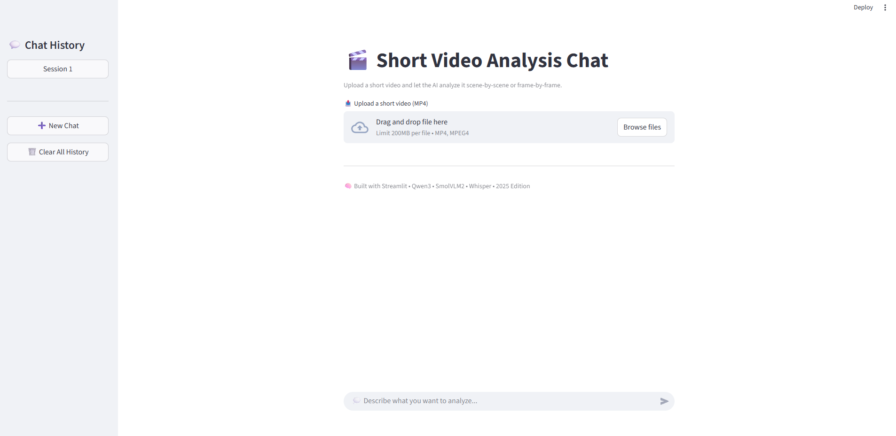

---

## 🚀 Overview

**Short Video Analyst** is a fully local AI desktop application that allows users to:

- 🧠 Analyze and query short `.mp4` videos through natural language
- 🗣️ Transcribe audio and detect key discussion topics
- 👁️ Recognize objects, scenes, and text in video frames
- 🧾 Generate PDF and PowerPoint summaries locally
- 💬 Maintain persistent chat memory even after restart

Everything runs **locally**, with **no cloud inference or external APIs**.

---

## 🧩 AI Agents Architecture
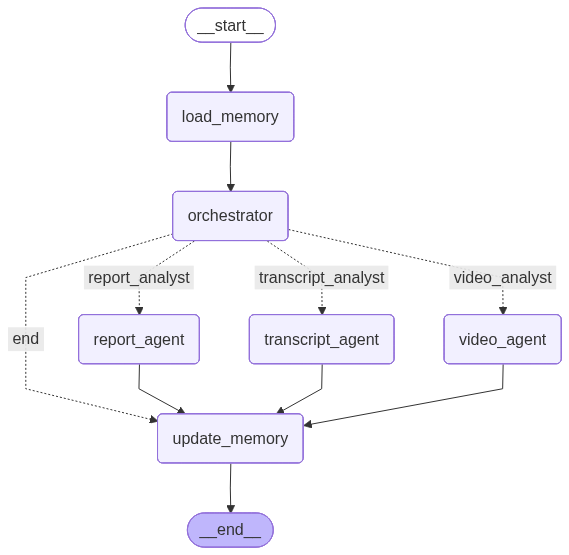

## 🧠 Core Technologies

| Component | Technology |
|------------|-------------|
| **Frontend** | Streamlit |
| **Backend Framework** | LangGraph + LangChain |
| **LLM / VLM Models** | Qwen1.7B, SmolVLM2, Whisper Tiny |
| **Report Generation** | ReportLab (PDF) + python-pptx |
| **Persistence** | Pickle-based chat memory |
| **Environment** | Conda-managed virtual environment |

---

## 🧪 Features

✅ Upload short video clips (≤ 1 minute)  
✅ Natural language queries like:
   - “Transcribe the video”
   - “What objects are shown?”
   - “Create a PowerPoint of the key points”  
✅ Multi-agent orchestration for transcription, vision, and generation  
✅ Offline inference with local Hugging Face models  
✅ Persistent memory store for previous chat sessions  
✅ Output generation: PDF & PPTX

## 🧰 Setup Guide

### 1️⃣ Clone Repository
- git clone https://github.com/ZhangHaoXuan21/Short-Video-Analysis-App.git
- cd Short-Video-Analysis-App

### 2️⃣ Setup Conda Environment
conda env create -f environment.yml -n <new_environment_name>

### 3️⃣ Run the App
streamlit run app.py

## 🧱 Example Workflow

### Example 1️⃣
1. Upload a short video
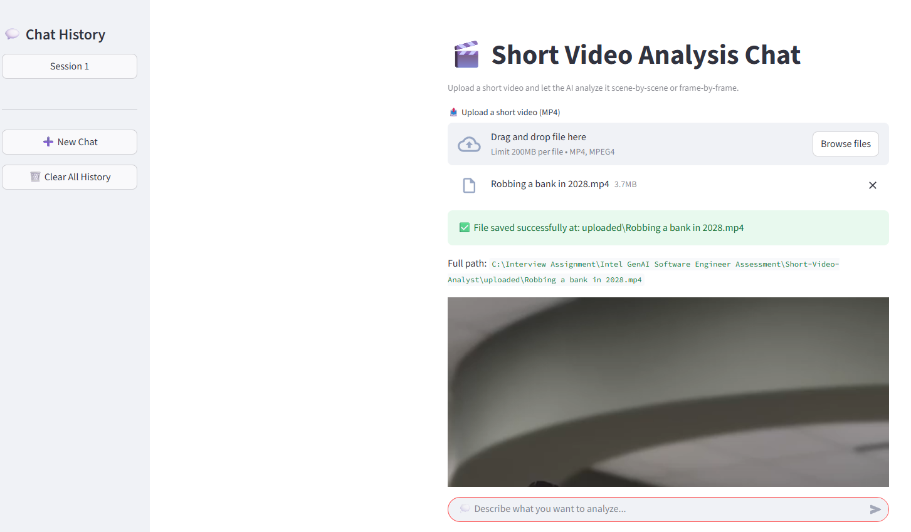

2. Get the video transcription
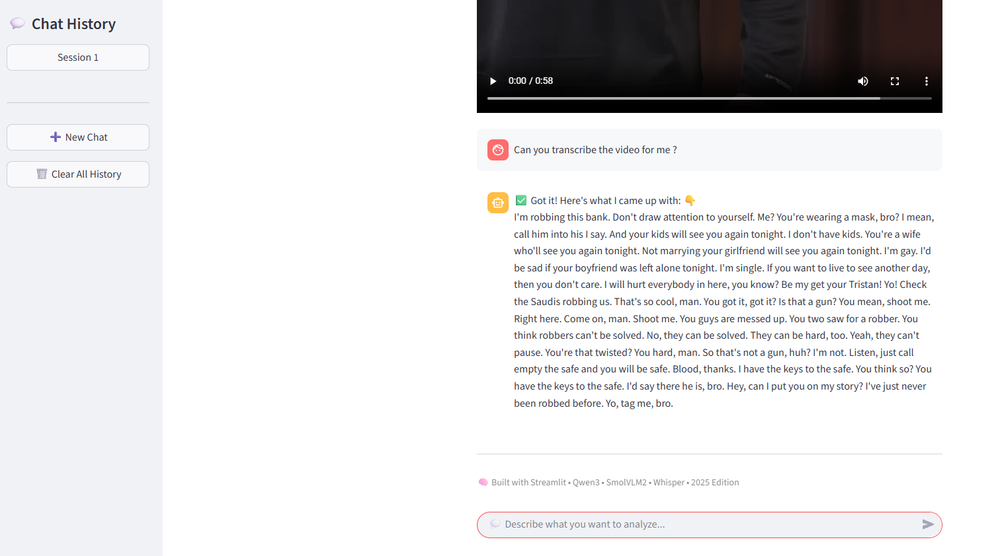

3. Perform Video Analysis
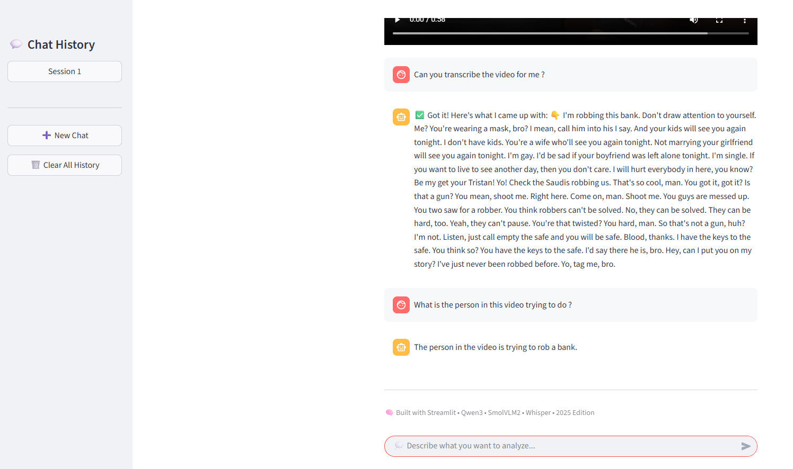

4. Generate PPTX File
- File can be located at demo_1/bank_robbery_discussion.pptx
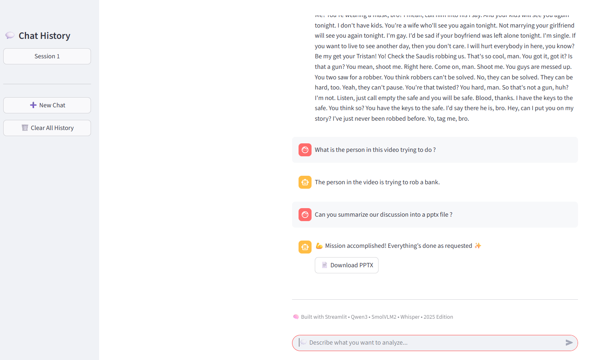

6. Generate PDF File
- File can be located at demo_1/discussion_summary.pdf
- Sometimes, the generation will fail due to wrong format (e.g: generate pptx instead of pdf), multiple retries are needed.
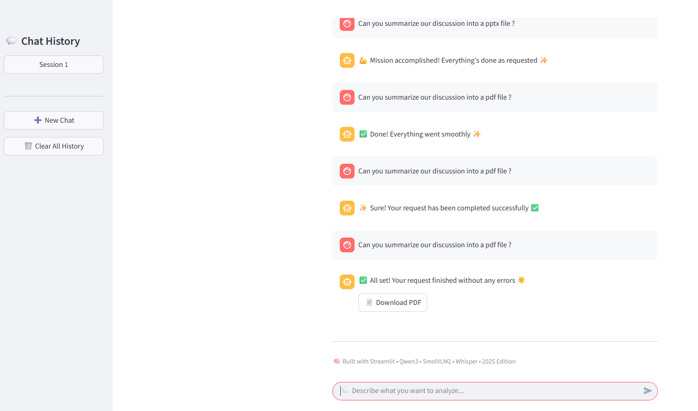

### Example 2️⃣
1. Upload a short video
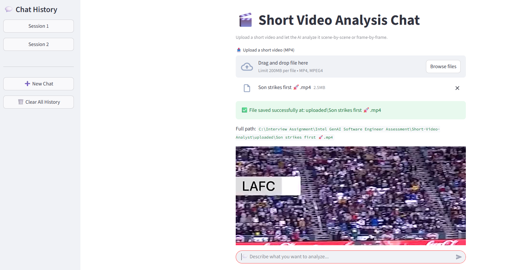

2. Get the video transcription
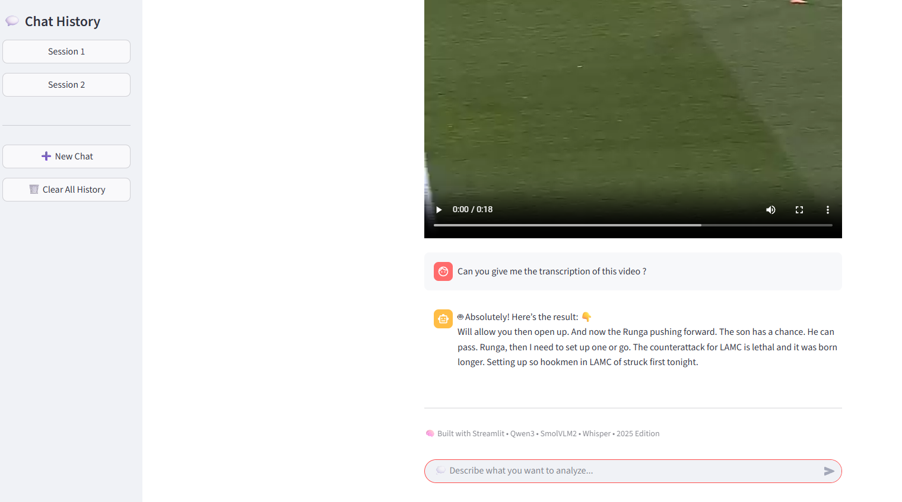

3. Perform Video Analysis
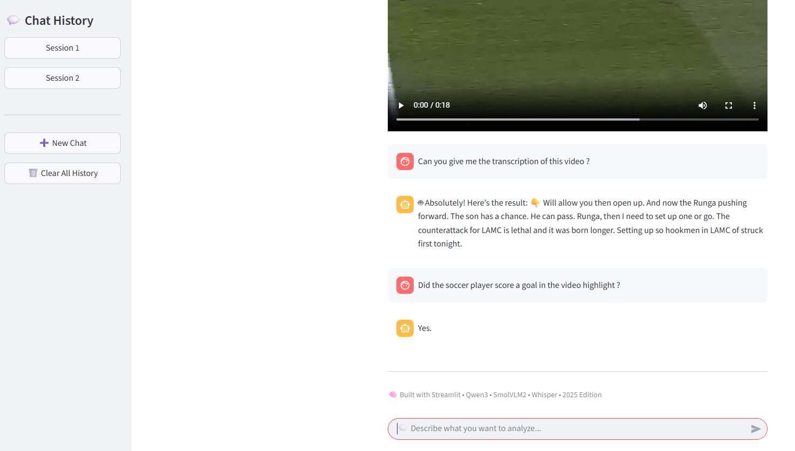

4. Generate PDF File
- File can be located at demo_2/summary_discussion.pdf.pdf
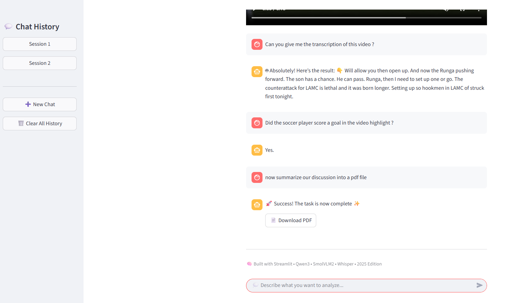

## 💡 Limitations & Future Work

- Model inference speed could be improved with OpenVINO optimization.
- Current Streamlit frontend could be ported to Tauri + React for production.
- Multi-agent coordination could later use gRPC or a proper MCP server for modularity.
- Further research on prompt engineering to improve response quality for small local models.
- Experiment with larger models (e.g., Mistral, Llama, or OpenVINO-optimized variants) to benchmark accuracy vs. latency.
- Add human-in-the-loop clarification flow for better alignment with user intent.
- Improve PDF/PPTX report generation layout and visual styling.
- Implement C# desktop launcher integration for seamless offline deployment.

---

## ✅ Requirement Fulfillment Summary

Below is a self-assessment summary of how this project meets the requirements.

### 💡 Functional Requirements
| Requirement | Status | Notes |
|--------------|---------|-------|
| Upload `.mp4` files | ✅ | Implemented via Streamlit uploader |
| Natural language interaction | ✅ | Query via chat interface |
| Example queries (“Transcribe”, “Create PPT”, “Summarize”, etc.) | ✅ | All supported via agents |
| Human-in-the-loop clarification | ❌ | No human-in-the-loop clarification  |
| Persistent chat history | ✅ | Implemented using pickle-based memory |

### 🧱 Architecture Requirements
| Requirement | Status | Notes |
|--------------|---------|-------|
| Frontend: React + Tauri | ❌ | Prototype implemented with Streamlit |
| Chat-style UI | ✅ | Streamlit chat layout implemented |
| Local persistent storage | ✅ | Pickle file memory system |
| Communication via gRPC | ❌ | No gRPC communication, internal Python-based communication for now |
| Backend: Python | ✅ | Fully Python-based architecture |
| Multiple agents | ✅ | Transcript, Vision, and Generation agents implemented |
| Local inference (OpenVINO / HF) | ✅ | All inference done locally with Hugging Face models |
| No cloud connectivity | ✅ | 100% offline operation |

### 🏆 Bonus Points
| Requirement | Status | Notes |
|--------------|---------|-------|
| Modular, well-structured code | ✅ | Agents and utilities modularized |
| Architecture diagram | ✅ | Logical architecture included; visual diagram planned |
| Detailed setup guide | ✅ | Conda + Streamlit setup documented |
| C# launcher | ❌ | Not implemented |

### 📦 Submission Completeness
| Requirement | Status | Notes |
|--------------|---------|-------|
| Source code (frontend + backend) | ✅ | Complete in this repository |
| Setup & execution guide | ✅ | Documented in README |
| Example files & outputs | ✅ | Provided (PDF/PPTX samples) |
| Summary & improvements | ✅ | Documented below in README |

---

> **Summary:**  
> This project successfully demonstrates a fully local, multi-agent GenAI system capable of analyzing, transcribing, and summarizing short videos offline.  
> Core features are functional and modular. Remaining items (OpenVINO optimization, gRPC API, Tauri frontend) are planned for future expansion.
